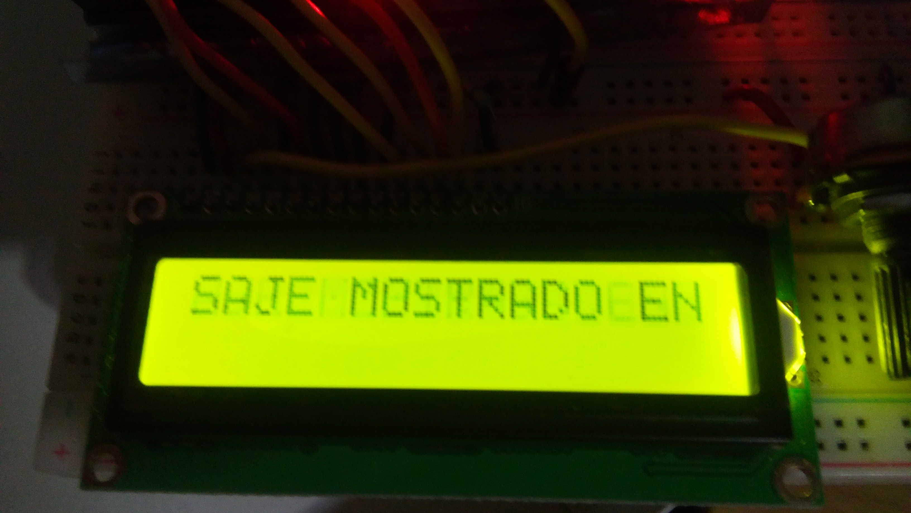
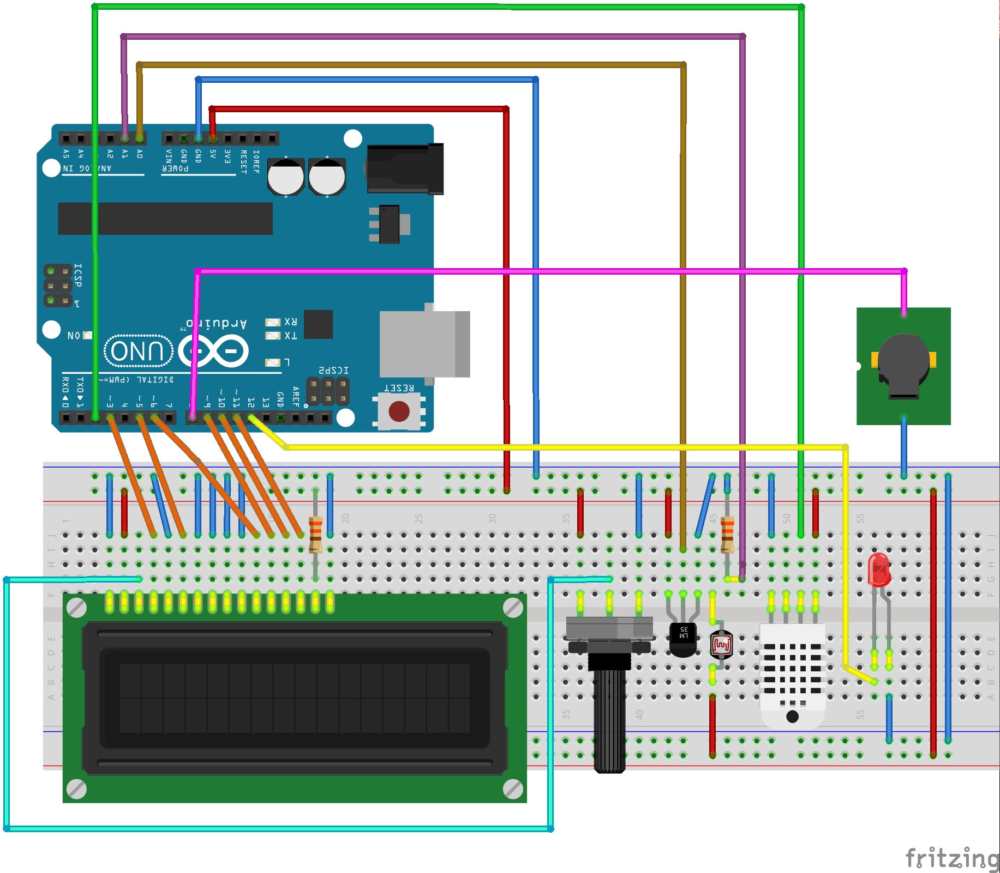
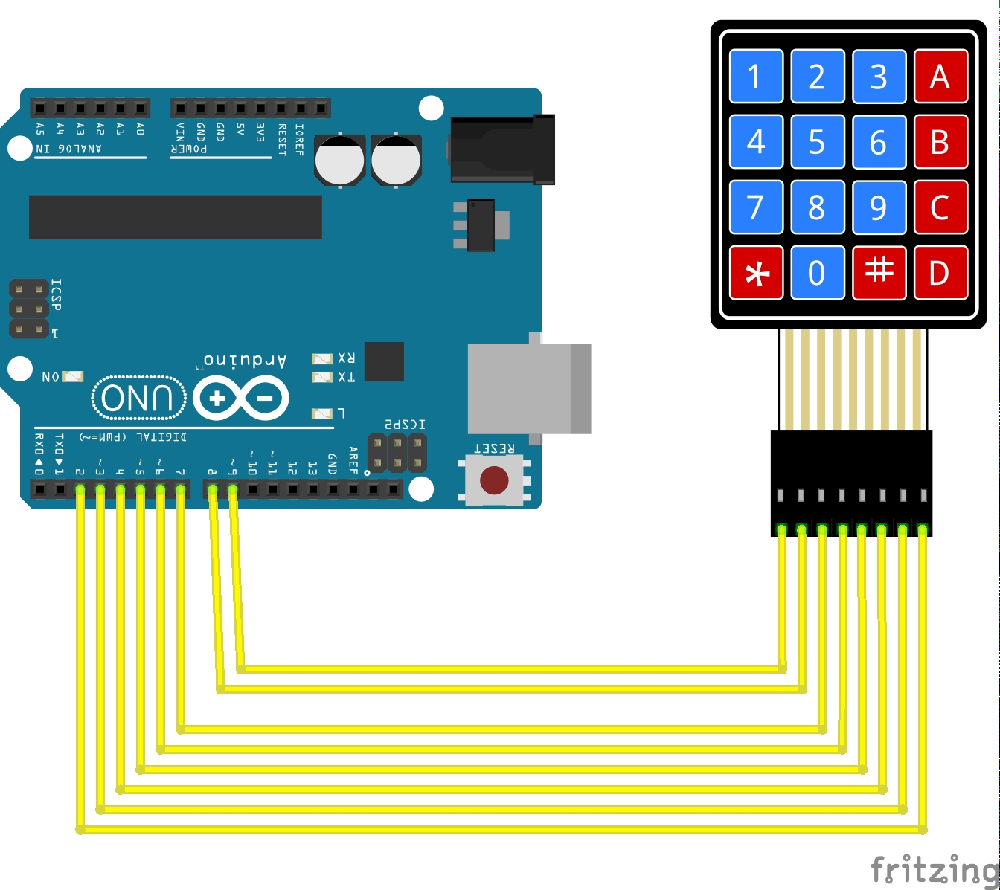
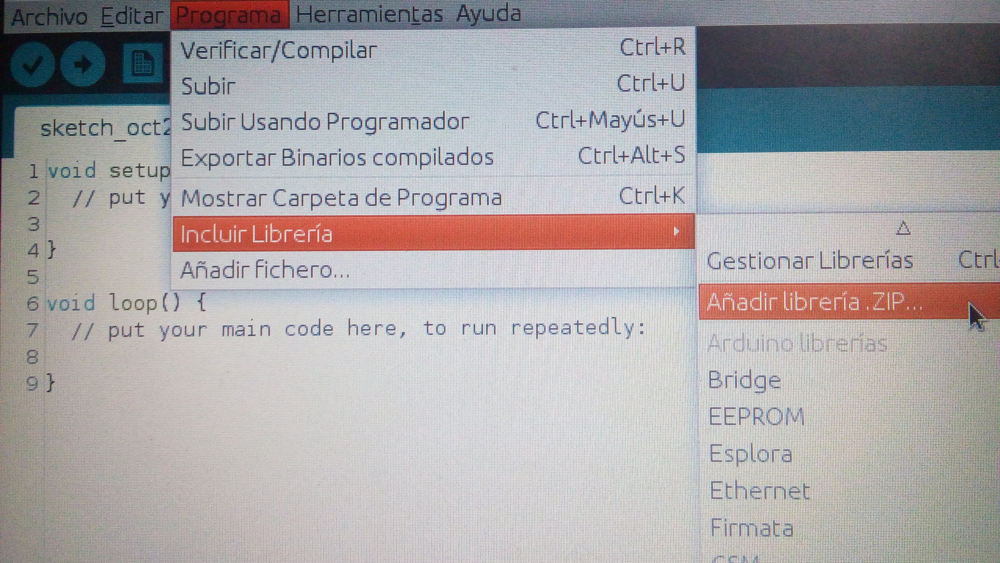
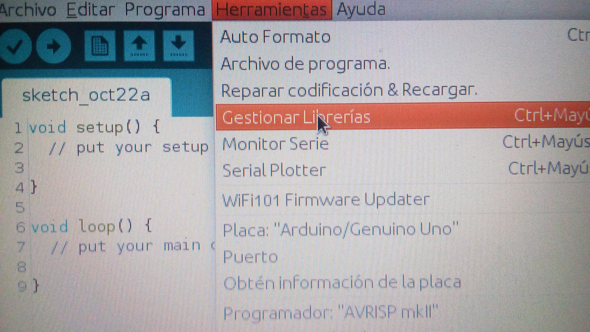
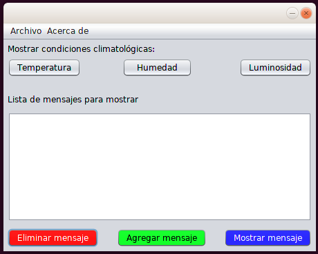
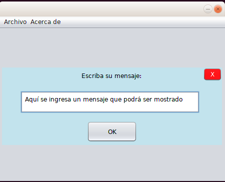
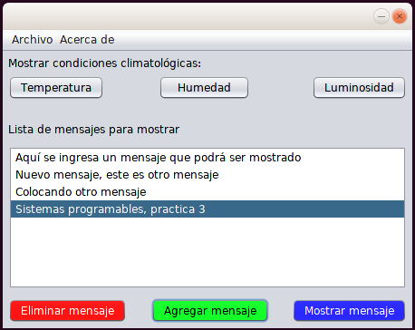
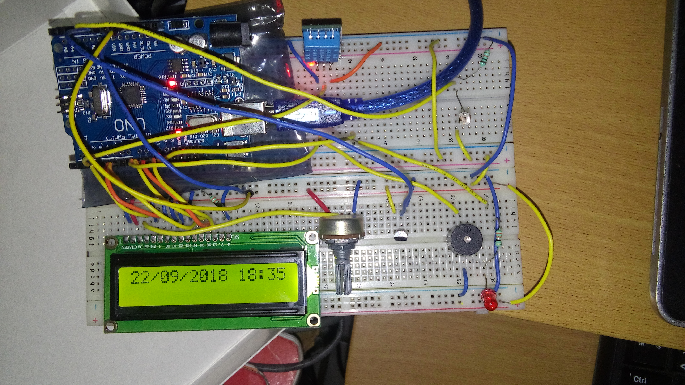
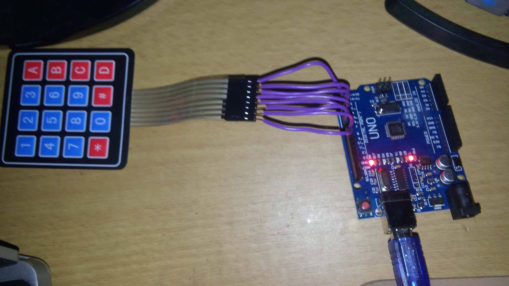

# Sistema Visualizador de mensajes
## Descripción
Consiste en un sistema para el despliegue de mensaje en una pantalla LCD, el objetivo es que al
llegar un individuo pueda ver en un pequeño tablero electronico una serie de mensajes almacenados, y le permita agregar, eliminar o visualizar dichos mensajes mediante un teclado matricial. 



## Objetivos
Cada mensaje tiene las siguientes caracteristicas:
- Muestra un mensaje que se entiende, con sólo 140 caracteres de espacio.
- Muestra fecha y hora en la que fue emitido el mensaje
- Muestra un mensaje del estado del tiempo (temperatura, humedad, luminosidad)

El sistema debe contener:
- Un interfaz de hardware para navegar entre los mensajes.
- Una interfaz de software para enviar los mensajes desde la computadora via serial.
- La interfaz de software debe permitir agreagr mensajes y/o borrarlos.

## Introducción

La temperatura es producto de la energía interna de un cuerpo, que tiene una característica relevante: la termodinámica, o la capacidad de generar 
energía cinética, que es energía que se produce por el movimiento, es decir, el movimiento de todas las partículas que conformas ese cuerpo específico.
Las partículas, mediante el movimiento, generan calor, lo cual se traduce de manera inmediata en variaciones de la temperatura del cuerpo.

Humedad del aire. Es la cantidad de vapor de agua presente en el aire. Se puede expresar de forma absoluta mediante la humedad absoluta, o de forma 
relativa mediante la humedad relativa o grado de humedad. ... Por ambas razones el aire caliente que contiene vapor de agua se eleva en la atmósfera.

La luz se caracteriza por su naturaleza dual, dado que se comporta al mismo tiempo como una onda electromagnética (por tanto, energía) y como una 
estructura integrada por pequeños corpúsculos denominados fotones (por tanto, materia). Esta condición permite explicar gran parte de sus propiedades 
únicas, entre las que sobresale la capacidad de la luz de ser el objeto más veloz en el vacío, con una capacidad de desplazamiento de 300 mil kilómetros 
por segundo.

## Comenzando 🚀
A continuación se explicarán los pre-requisitos, su instalación, etc.

### Pre-requisitos 📋
**Material físico**:
```
-2 placa arduino (UNO) con su cable para conectar
-1 protoboard
-1 LCD 16x2
-1 teclado matricial
-1 sensor de humedad DHT11
-1 sensor de temperatura LM35
-1 fotoresistencia
-1 led
-2 resistencias de 330 Ohms
-1 resistencia de 10k
-1 potenciómetro de 10k
-1 buzzer
-Cables
```
**Software**:
```
-1 equipo con:
  -Arduino IDE instalado
  -OpenJDK instalado
  -Netbeans IDE instalado

-Darle permisos dialout al usuario del equipo para arduino (Linux)
-Driver instalado de la placa para arduino (Windows)
```

## Instalación del sistema 🔧
## Paso 1. Instalar Netbeans 

### Instalación de Netbeans IDE con OpenJDK

**1. Instalar Open Java Development Kit (OpenJDK)**
```
sudo apt-get install openjdk-8-jdk" 
```
**2. Verificar versión de Java (OpenJDK) version**
```
java -version
```
**3. Configurar las variables de desarrollo para todos los usuarios**
```
sudo nano /etc/profile 
```
  Añadir estas líneas al final del archivo y guardar:
```
JAVA_HOME="/usr/lib/jvm/java-8-openjdk-amd64/bin/java" 
JRE_HOME="/usr/lib/jvm/java-8-openjdk-amd64/jre/bin/java" 
PATH=$PATH:$HOME/bin:JAVA_HOME:JRE_HOME 
```

**4. Ejecutar este comando después de guardar cambios**
```
". /etc/profile" 
```

**5. Checar las variables de desarrollo**
```
eecho $JAVA_HOME 
echo $JRE_HOME
```

**6. Descargar Netbeans**

**7. Colocarse en la ruta donde se desargó el archivo.sh de Netbeans**
```
cd /Descargas
```

**8. Ejecutar el archivo netbeans.sh**
```
sudo sh netbeans-8.1-linux.sh
```

**9. Se abrirá la ventana de instalación de Netbeans, cuando llegue a poner la ruta para el jdk, elegir esta**
```
/usr/lib/jvm/java-8-openjdk/amd64/”
```
**10. ¡Listo!**

## Paso 2. Armar circuitos
**Arduino 1**



**Arduino 2**



## Paso 3. Importar librerías de arduino
### ¿Como importar librerías?
**DHT11:** <br/>
 Descargar: <br/>
 https://drive.google.com/drive/folders/0B0hsUkhqWH97dHFBeTNZd2ZyRjQ?fbclid=IwAR02XiuCEleWPzzFiiCz1LsigFftZ2w3A4RN7cNwJZCmmATRRy3CLEELFD8 <br/>
 Forma 1 - Descomprimir archivo DHT11 en carpeta /home/arduino/libraries <br/>
 Forma 2 - añadiendo el archivo .zip en arduino en Programas/Incluir librerías... <br/>



**LiquidCrystal y keypad:** <br/>
  En arduino IDE dirigirse a Herramientas/Gestionar librerías, buscar las librerías e instalarlas
  


## Paso 4. Cargar programas a las placas arduino
### Programa arduino 1
- Abre el arduino IDE en tu equipo
- Carga en el IDE el archivo sistemaVisualizadorMensajes.ino
- Conecta la placa arduino a tu equipo
- Importa librerías:
  - DHT11
  - LiquidCrystal
- Compila el código en el Arduino IDE
- Selecciona el puerto para la placa
```
   /dev/ttyUSB0
```
- Carga el programa a la placa arduino

### Programa arduino 2
- Abre otro arduino IDE en tu equipo
- Carga en el IDE el archivo TecladoMatricial/TecladoMatricial.ino
- Conecta la otra placa arduino a tu equipo
- Importar librería:
  - Keypad
- Compila el código en el Arduino IDE
- Selecciona el otro puerto para la placa
```
   /dev/ttyUSB1
```
- Carga el programa a la placa arduino

## Paso 5. Ejecutar la aplicación en Netbeans IDE
- Abre Netbeans IDE
- Importa el proyecto llamado SistemaVisualizadorDeMensajes
- Importar librería PanamaHitek_arduino (que es la que permite la comunicación serial entre arduino y java)
   http://panamahitek.com/libreria-panamahitek_arduino/
```
   Clic derecho en bibliotecas (del proyecto)
   Añadir archivo JAR/Carpeta
   Buscar y seleccionar la librería PanamaHitek_Arduino-3.0.0.jar
```
- Ejucutar aplicación


## Aplicación 🔩
### Inicio


### Añadir mensaje


### Lista de mensajes añadidos


## Control del teclado matricial
 - 1 - Ir al inicio de la lista de mensajes
 - 2 - Ir al mensaje anterior
 - 3 - Ir al final de la lista de mensajes
 - 4 - (En el modal agregar mensaje) Permite agregar el mensaje a la lista de mensajes
 - 5 - Ir al mensaje posterior
 - 6 - (En el modal agregar mensaje) Permite cancelar el agregado del mensaje
 - 7 - Muestra la temperatura en el display
 - 8 - Muestra la humedad en el display
 - 9 - Muestra la luminosidad en el display
 - A - Abre el modal para añadir un mensaje
 - B - Muestra en el display el mensaje seleccionado
 - C - Elimina el mensaje seleccionado

## Resultados 📌
 - Los 140 caracteres para cada mensaje son validados en la aplicación tras agregar mensaje
 - Cuando se muestra un mensaje en el display al final viene la fecha de emisión
 - La aplicación cuenta con 3 botones para mostrar en el display la temperatura, humedad y luminosidad
 - La interfaz de hardware para navegar entre los mensajes es el teclado matricial
 - La interfaz de software que permite la comunicación serial, añadir y eliminar mensajes es la aplicación hecha en java (Netbeans IDE)
 
 **NOTAS:** 
 - Se tuvo que hacer uso de 2 arduinos, porque la cantidad de pines digitales del arduino uno no son suficientes para esta práctica.
 - Si se desmontan los arduinos del ordenador, se tienen que cargar nuevamente los programas.ino a los arduinos, esto es para que el ordenador reconozca los puertos USB (USB0 y USB1), con la finalidad que los arduinos y NetBeans puedan detectarlos de igual manera.

 
  **Funcionalidad extra:**
 - Alarma que suena y prende cuando la temperatura excede a un cierto valor.





## Construido con 🛠️

Arduino IDE
* [Arduino](http://www.arduino.cc/) <br />

Netbeans IDE
* [NetBeans](https://netbeans.org/) <br/>

Fritzing
* [Fritzing](http://fritzing.org/home/) <br/>


## Autores ✒️

* **Jorge Enrique Aguado Guaní** - [JorgeGuani](https://github.com/JorgeGuani)
* **Natalia Méndez Martínez** - [Yaxe9512](https://github.com/Yaxe9512)
